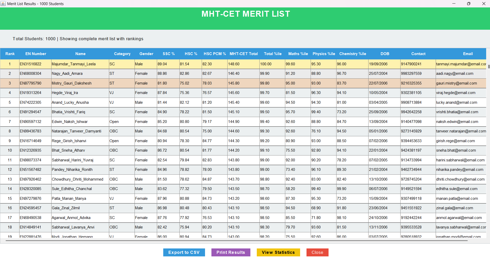

# MHT-CET Merit List Generator



This project now includes **two versions**:

### **GUI Version (Recommended)**
- **Interactive graphical interface**
- **CSV file upload** for bulk processing
- **Automated processing pipeline**
- **Beautiful results table** with export/print options
- **Statistics dashboard**

**To run GUI version:**
```powershell
# Double-click run_gui.bat OR:
javac *.java
java MHTCETGuiApp
```

### **Console Version (Original)**
- Command-line interface
- Manual data entry for each student
- Real-time validation and feedback

**To run console version:**
```powershell
javac *.java
java Rank
```

---

## Project Overview

This Java application generates a merit list for students based on their MHT-CET (Maharashtra Health and Technical Common Entrance Test) scores, along with their SSC and HSC academic records. The system collects comprehensive student data, calculates percentiles, and ranks students according to a complex merit calculation algorithm.

## Table of Contents
- [Project Flow](#project-flow)
- [Java OOP Concepts Used](#java-oop-concepts-used)
- [Class Structure](#class-structure)
- [Key Features](#key-features)
- [Merit Ranking Algorithm](#merit-ranking-algorithm)
- [How to Run](#how-to-run)
- [Input Requirements](#input-requirements)
- [Output Format](#output-format)

## Project Flow

### 1. **Data Collection Phase**
   - Prompts user for number of students
   - For each student, collects:
     - Personal details (EN number, name, contact, email, category, gender, etc.)
     - SSC marks (6 subjects with best-of-5 calculation)
     - HSC marks (5 subjects with PCM calculation)
     - MHT-CET scores (Physics, Chemistry, Mathematics)
     - Date of birth for tie-breaking

### 2. **Validation Phase**
   - Validates EN number format (8 digits)
   - Validates contact number (10 digits)
   - Ensures marks are within valid ranges
   - Validates date of birth including leap year calculations

### 3. **Calculation Phase**
   - Calculates SSC percentage (best of 5 subjects out of 6)
   - Calculates HSC percentage and PCM percentage
   - Computes MHT-CET total scores
   - Generates percentiles for each subject and overall

### 4. **Ranking Phase**
   - Sorts students based on multiple criteria hierarchy
   - Handles tie-breaking scenarios systematically
   - Generates final merit list

### 5. **Output Phase**
   - Displays comprehensive merit list with all relevant details
   - Shows ranking with complete academic breakdown

## Java OOP Concepts Used

### 1. **Encapsulation**
- **Private Data Members**: All class attributes are declared private
- **Getter/Setter Methods**: Public methods provide controlled access to private fields
- **Example**: In `Detail.java`, all fields like `EN`, `name`, `category` are private with corresponding getter/setter methods

### 2. **Classes and Objects**
- **Multiple Classes**: Project uses 7 different classes representing different entities
- **Object Creation**: Arrays of objects are used to store multiple student records
- **Example**: `Detail[] s = new Detail[n]` creates an array of student objects

### 3. **Composition (Has-A Relationship)**
- **Complex Object Structure**: `Detail` class contains objects of other classes
- **Nested Objects**: Student details contain SSC, HSC, MHT-CET, DOB, and Percentile objects
- **Example**: `Detail` has `SSCDetails`, `HSCDetails`, `MHTCETDetails`, `DOB`, and `MHTCETPercentileDetails`

### 4. **Static Methods and Utility Classes**
- **Utility Class**: `MHTCETUtility` contains only static methods
- **Helper Functions**: Static methods for calculations, sorting, and validations
- **Example**: `MHTCETUtility.calculatePercentage()`, `MHTCETUtility.countDigit()`

### 5. **Method Overloading (Implicit)**
- Different sorting methods with similar functionality but different parameters
- Methods like `sortByMathsPercentile()`, `sortByPhysicsPercentile()` follow similar patterns

### 6. **Data Abstraction**
- **Separation of Concerns**: Each class handles specific data and operations
- **Modular Design**: Different aspects (SSC, HSC, MHT-CET) are abstracted into separate classes

## Class Structure

### 1. **Rank.java** (Main Class)
- **Purpose**: Entry point and main logic controller
- **Responsibilities**: User interaction, data collection, orchestrating the ranking process

### 2. **Detail.java** (Student Entity)
- **Purpose**: Represents a complete student record
- **Key Attributes**: 
  - Personal info (EN, name, phone, email, category, gender)
  - Academic records (SSC, HSC, MHT-CET objects)
  - Calculated values (percentages, percentiles)

### 3. **SSCDetails.java** (SSC Academic Record)
- **Purpose**: Stores Secondary School Certificate marks
- **Subjects**: English, Maths, Science, Social Studies, Hindi, Marathi
- **Special Logic**: Best-of-5 calculation (excludes lowest scoring subject)

### 4. **HSCDetails.java** (HSC Academic Record)
- **Purpose**: Stores Higher Secondary Certificate marks
- **Subjects**: English, Physics, Chemistry, Maths, Vocational
- **Calculations**: Total marks and PCM (Physics-Chemistry-Mathematics) percentage

### 5. **MHTCETDetails.java** (Entrance Test Record)
- **Purpose**: Stores MHT-CET examination scores
- **Subjects**: Physics (50 marks), Chemistry (50 marks), Mathematics (100 marks)
- **Total**: Combined score out of 200 marks

### 6. **DOB.java** (Date of Birth)
- **Purpose**: Stores birth date information
- **Usage**: Used for tie-breaking in merit calculation
- **Validation**: Includes leap year and month-wise date validation

### 7. **MHTCETPercentileDetails.java** (Percentile Calculator)
- **Purpose**: Stores calculated percentiles for ranking
- **Percentiles**: Subject-wise and overall percentiles
- **Data Type**: Uses `double` for precision in percentile calculations

### 8. **MHTCETUtility.java** (Utility Functions)
- **Purpose**: Contains all helper and calculation methods
- **Key Methods**:
  - Percentage calculations
  - Digit counting for validation
  - Percentile calculation and assignment
  - Multiple sorting algorithms for tie-breaking

## Key Features

### 1. **Comprehensive Data Validation**
- EN number format validation (8 digits)
- Phone number validation (10 digits)
- Marks range validation (subject-specific limits)
- Date validation with leap year support

### 2. **Complex Academic Calculations**
- SSC best-of-5 calculation
- HSC PCM percentage calculation
- Percentile computation based on relative performance

### 3. **Sophisticated Ranking System**
- Primary ranking by MHT-CET total percentile
- 14-level tie-breaking hierarchy
- Age-based final tie-breaking (older students ranked higher)

### 4. **User-Friendly Interface**
- Step-by-step data collection
- Clear error messages for invalid inputs
- Organized output with tabular format

## Merit Ranking Algorithm

The ranking follows a strict hierarchy to handle ties:

1. **MHT-CET Total Percentile** (Primary criterion)
2. **MHT-CET Mathematics Percentile**
3. **MHT-CET Physics Percentile**
4. **MHT-CET Chemistry Percentile**
5. **HSC PCM Percentage**
6. **HSC Mathematics Marks**
7. **HSC Physics Marks**
8. **HSC Total Marks**
9. **SSC Total Marks**
10. **SSC Mathematics Marks**
11. **SSC Science Marks**
12. **SSC English Marks**
13. **Birth Year** (Older students preferred)
14. **Birth Month** (Earlier month preferred if same year)
15. **Birth Day** (Earlier day preferred if same month/year)

## How to Run

### Prerequisites
- Java Development Kit (JDK) 8 or higher
- Any Java IDE or command line interface

### Compilation and Execution
```bash
# Compile all Java files
javac *.java

# Run the main program
java Rank
```

### Step-by-Step Execution
1. Enter the number of students
2. For each student, provide:
   - EN number (8 digits)
   - Personal details
   - SSC marks (6 subjects)
   - HSC marks (5 subjects)
   - MHT-CET scores (3 subjects)
   - Date of birth
3. View the generated merit list

## Input Requirements

### Personal Details
- **EN Number**: 8-digit enrollment number
- **Name**: Format "Surname_FirstName_LastName"
- **Contact**: 10-digit phone number
- **Email**: Valid email address
- **Category**: Open/SC/ST/OBC/SBC
- **Gender**: Male/Female/Other
- **Special Categories**: PWD/DEF, EWS, TFWS, Orphan, Minority status

### Academic Marks
- **SSC Subjects**: English, Maths, Science, Social Studies, Hindi, Marathi (0-100 each)
- **HSC Subjects**: English, Physics, Chemistry, Maths (0-100 each), Vocational (0-200)
- **MHT-CET**: Physics (0-50), Chemistry (0-50), Mathematics (0-100)

### Date of Birth
- Valid day, month, and year
- Automatic leap year validation
- Month-specific day validation

## Output Format

The merit list displays:
- Merit rank
- Application ID (EN number)
- Student name and demographic details
- All percentiles (Total, Maths, Physics, Chemistry)
- Academic performance breakdown
- Date of birth

## Technical Highlights

### 1. **Efficient Sorting Algorithms**
- Bubble sort implementation for percentile calculation
- Selective comparison for tie-breaking scenarios

### 2. **Memory Management**
- Array-based storage for multiple student records
- Object composition for organized data structure

### 3. **Input Validation**
- Comprehensive validation for all data types
- Error handling with user-friendly messages

### 4. **Modular Design**
- Separation of concerns across multiple classes
- Reusable utility methods for common operations

## Educational Value

This project demonstrates:
- Real-world application of OOP principles
- Complex business logic implementation
- Data validation and error handling
- Algorithm design for ranking systems
- User interface design in console applications

The project effectively combines multiple Java OOP concepts to create a practical application that could be used in educational institutions for merit list generation and student ranking systems.
